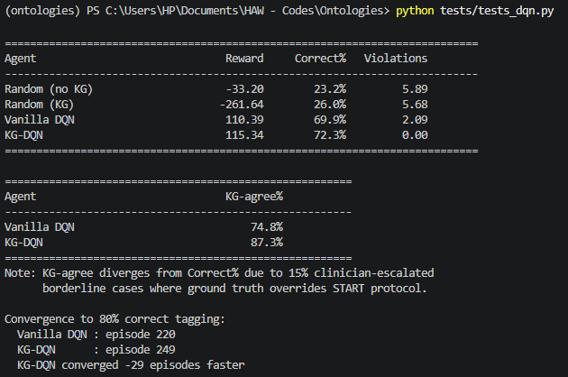
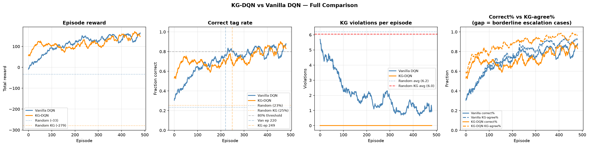
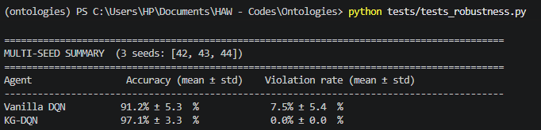
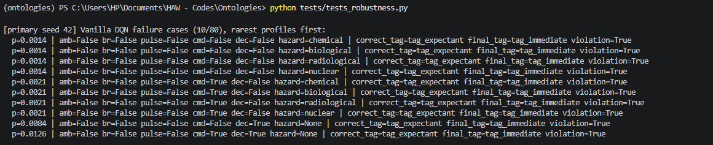
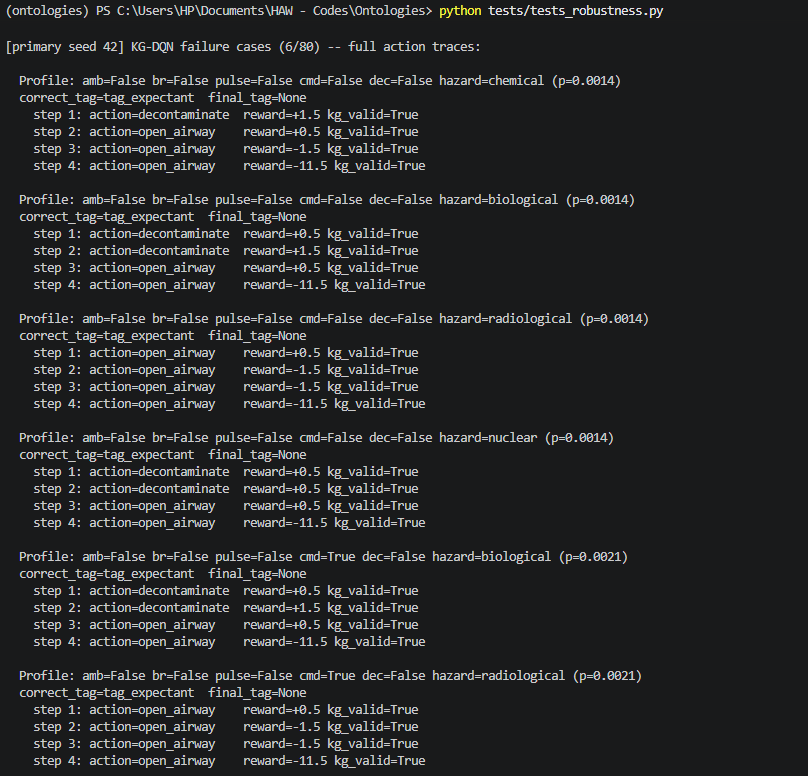

# KG-DQN: A Knowledge-Graph-Constrained Reinforcement Learning Agent for Mass Casualty Triage

This repository contains the code, ontology, trained checkpoints, and evaluation results for a short paper submitted to **KG-NeSy 2026** (Third International Workshop on Knowledge Graphs and Neurosymbolic AI, co-located with ISWC 2026, Bari, Italy).

> **In one sentence:** we encode the START mass-casualty triage protocol (plus CBRN decontamination rules) as a reasoner-validated OWL/SWRL ontology, and use it to *structurally* block a Deep Q-Network agent from ever taking a clinically unsafe action — instead of just penalizing unsafe actions and hoping the agent learns to avoid them.

> **Branches:** this is `main` — the core system, ontology, and the multi-seed robustness experiment reported in the paper. A second branch, [`syn_STARTS_validation`](../../tree/syn_STARTS_validation), shares the same ontology and reasoner code and adds an independent external validation against Syn-STARTS, a structured triage benchmark dataset (not part of the core paper experiment).

---

## Table of Contents

- [Why this project exists](#why-this-project-exists)
- [The core idea, explained simply](#the-core-idea-explained-simply)
- [Repository structure](#repository-structure)
- [Setup](#setup)
- [How to run everything, in order](#how-to-run-everything-in-order)
- [File-by-file guide: what each file does and what its output means](#file-by-file-guide-what-each-file-does-and-what-its-output-means)
- [Results folder](#results-folder)
- [Acknowledgments](#acknowledgments)

---

## Why this project exists

In a mass casualty incident (MCI) — a disaster, attack, or accident with more patients than available medical resources — first responders use the **START protocol** to quickly sort patients into four categories: **Minor**, **Delayed**, **Immediate**, or **Expectant**. When the incident also involves chemical, biological, radiological, or nuclear (CBRN) contamination, patients additionally need **decontamination before treatment**.

A reinforcement learning (RL) agent can, in principle, learn this sorting task from simulated experience. But a standard ("vanilla") RL agent has **no guarantee** it won't take a clinically wrong action — especially for rare patient types it barely saw during training. In a domain like triage, a wrong action means misallocating scarce resources away from a patient who could have been saved. That's not an acceptable failure mode, no matter how rare.

This project builds a **symbolic safety layer**: an OWL/RDF ontology that encodes the START rules and CBRN rules as formal logic, validated by an actual automated reasoner (not just hand-written if/else code), which is then used to **mask out** (make unselectable) any action the agent could take that would violate the protocol. The RL agent literally cannot pick a forbidden action — it's not that it's been trained to avoid it, it *physically isn't an option*.

## The core idea, explained simply

Think of it like this: a vanilla RL agent is a student who has only ever been *graded down* for wrong answers — given enough practice, they usually learn to avoid mistakes, but nothing stops them from occasionally making one, especially on questions they rarely see. Our agent is a student taking a multiple-choice test where the genuinely wrong answers have been **physically removed from the page** for certain rare/critical scenarios. They can still choose poorly among what's left, but they can never select an answer that was never offered.

We compare two agents trained on identical patient scenarios:
- **Vanilla DQN** — a standard Deep Q-Network. Wrong/unsafe actions are heavily penalized (–50 reward) but still *executable*.
- **KG-DQN** — the same network architecture, but unsafe actions are removed from its choices entirely via the ontology-derived mask.

We then test both **exhaustively** — not just on random episodes, but on *every one of the 120 possible patient profiles* the environment can generate (the 16 binary combinations of the four core vital signs, each split by tachypnea status when breathing, crossed with clean or one of four CBRN hazard types) — across three different random training seeds, to see whether the safety guarantee actually holds everywhere, and whether it costs anything in accuracy.

---

## Repository structure

```
.
├── ontology/
│   └── triage_v2.rdf              # The knowledge graph itself (OWL/RDF + SWRL rules)
├── src/
│   ├── env/
│   │   ├── dqn.py                 # Neural network architecture + replay buffer
│   │   ├── mci_env.py             # The Gymnasium RL environment (the "world" the agent acts in)
│   │   └── patient_generator.py   # Generates random simulated patients
│   ├── kg/
│   │   └── constraint_guard.py    # Bridge between the ontology and Python; runs the reasoner
│   └── eval/
│       └── exhaustive_eval.py     # Defines and runs the 120-profile exhaustive test
├── train/
│   ├── train_dqn.py               # The training loop for both agents
│   └── random_agent.py            # Sanity-check baseline (acts completely randomly)
├── tests/
│   ├── tests_kg.py                # Unit tests for the ontology/reasoner logic alone
│   ├── tests_hazard.py            # Unit tests for CBRN hazard/decontamination logic
│   ├── tests_env.py               # Tests the Gymnasium environment wiring
│   ├── tests_dqn.py               # Quick single-seed training + comparison (dev smoke test)
│   └── tests_robustness.py        # THE paper's main experiment: multi-seed, exhaustive evaluation
├── results/                       # All generated outputs land here (created automatically)
│   ├── *.pt                       # Trained model checkpoints
│   ├── *.csv                      # Per-profile evaluation results
│   └── *.png                      # Figures
└── README.MD                      # This file
```


---

## Setup

```bash
conda create -n ontologies python=3.10
conda activate ontologies
pip install gymnasium numpy torch owlready2 matplotlib
```

> **Note on the reasoner:** `constraint_guard.py` uses Pellet via `owlready2`. Pellet requires a Java runtime (JRE/JDK) to be installed and on your `PATH`, since Pellet itself is a Java program that `owlready2` calls out to.

All scripts assume they are run from the **repository root** (e.g., `python tests/tests_robustness.py`, not from inside the `tests/` folder), since several files resolve paths like `ontology/triage_v2.rdf` relative to the working directory.

---

## How to run everything, in order

If you're setting this up fresh, run things in this order — each step builds on the last:

1. **`python tests/tests_kg.py`** — confirms the ontology and reasoner are working correctly, in isolation, before anything else touches them.
2. **`python tests/tests_hazard.py`** — confirms the CBRN decontamination logic is wired correctly.
3. **`python tests/tests_env.py`** — confirms the RL environment itself behaves correctly (action masking, rewards, multi-step decontamination).
4. **`python tests/tests_dqn.py`** *(optional, quick)* — a fast single-seed sanity check that training runs end-to-end without crashing, and produces a first comparison plot.
5. **`python tests/tests_robustness.py`** — **this is the real experiment.** Trains both agents three times (three random seeds), evaluates them exhaustively, and produces every number and figure reported in the paper. This takes a while — it trains six full models (Vanilla + KG-DQN, × 3 seeds).

Steps 1–3 are fast (seconds to low minutes). Step 5 is the long one — budget real time for it.

---

## File-by-file guide: what each file does and what its output means

### `ontology/triage_v2.rdf`

This is **not Python code** — it's the knowledge graph itself, written in OWL/RDF (a formal logic format), editable visually in a tool called Protégé. It defines:
- The four START categories (**Minor**, **Delayed**, **Immediate**, **Expectant**) as logical definitions over patient vitals (ambulation, breathing, respiratory rate / tachypnea, pulse, mental status, decontamination status) — not hardcoded rules, but formal class definitions a reasoner can derive conclusions from. This includes **START Rule 3** (respiratory rate > 30 → tachypneic → Immediate), encoded via a dedicated `hasRespiratoryRate` datatype property and `TachypneaStatus` class hierarchy, cross-checked by SWRL rules `START_rule3b_tachypnea` and `START_rule3c_tachypnea_immediate`, with a `NOT tachypneic` guard on `START_rule6_delayed` to prevent conflicting `treatmentRequired` assertions.
- Four CBRN hazard types (Chemical, Biological, Radiological, Nuclear), each with a required number of decontamination steps.
- SWRL rules that *independently* compute a recommended treatment action and severity score, used to cross-check the formal class definitions agree with each other.

You won't run this file directly — every other file in `src/kg/` and `src/env/` reads it.

---

### `src/kg/constraint_guard.py`

This is the bridge between the ontology file and your Python code. On load, it:
1. Reads `triage_v2.rdf`.
2. Runs the **Pellet reasoner** once, over all 64 enumerable binary patient profiles (6 binary dimensions: ambulatory, breathing, pulse, follows-commands, decontaminated, tachypneic), of which **48 are clinically coherent** — the remaining 16 ("tachypneic while not breathing") are excluded as clinically meaningless. For each of the 48, it computes both the formal-logic classification *and* the SWRL-rule-based classification, and checks they agree (if they don't, it raises an error immediately rather than silently using bad data).
3. Caches the result into a fast lookup table, so every later check during training/evaluation is just a dictionary lookup rather than re-running the reasoner each time.

Exposes functions like `check_action()` (is this action allowed for this patient?) and `get_valid_actions()` (the full mask of allowed actions), used by the environment on every single step. `create_patient()` also accepts an optional `respiratory_rate` argument, which drives the tachypnea inference for any single patient created outside the lookup table.

---

### `src/env/patient_generator.py`

Generates one random simulated patient: random ambulatory/breathing/pulse/mental-status/decontamination status, plus tachypnea status (sampled conditionally on breathing), plus a random CBRN hazard if contaminated, plus the "correct" ground-truth triage tag computed from the same START logic (with 15% of otherwise-stable patients having their label stochastically escalated, to simulate real-world clinician override/uncertainty).

---

### `src/env/mci_env.py`

The actual **Gymnasium environment** — the simulated "world." Each episode presents 10 patients in sequence. The agent has 7 possible actions per step (4 tagging actions that end a patient's turn, plus `open_airway`, `treat`, `decontaminate` which keep the same patient active for up to **5** actions total). If `use_kg_constraint=True`, the action mask from `constraint_guard.py` is enforced — the agent cannot select a blocked action at all. If `False` (Vanilla mode), a blocked action is allowed but penalized –50.

---

### `src/env/dqn.py`

The neural network itself: a small feed-forward network (**12 inputs** → 64 → 64 → 7 outputs) that estimates how good each of the 7 actions is in a given patient state, plus a replay buffer (a memory of past experience used to stabilize training, standard in DQN). The 12-dimensional observation is the five binary vital signs, a treated flag, a tachypnea flag, a one-hot hazard-type encoding, and a decontamination-progress fraction.

---

### `src/eval/exhaustive_eval.py`

Defines the **120 enumerable patient profiles** — the 16 combinations of the four core binary vital signs, each further split by tachypnea status when breathing, crossed with five contamination states (clean, or one of four CBRN hazard types) — and runs a trained model against every single one, deterministically, recording whether it got the correct tag and whether it ever violated the ontology along the way. This is the rigorous evaluation — not a random sample, the *entire* space of possible initial patients.

---

### `train/train_dqn.py`

The training loop. Standard epsilon-greedy DQN with a target network. The one important design choice: every 20 episodes, it checks the current network against the full 120-profile exhaustive set (not just a rolling average of recent training episodes) and only saves the checkpoint if that score improved. This prevents accidentally keeping a lucky-but-bad snapshot just because training happened to end at the right/wrong moment.

---

### `tests/tests_kg.py`

**Run:** `python tests/tests_kg.py`

Isolated unit tests confirming the ontology + reasoner correctly encode each START rule and the CBRN decontamination rule, with no RL agent involved at all — pure symbolic logic checks.


Each line printed is `PASS scenario N: <description>`, ending in `All scenarios passed.` Every `PASS` confirms one specific clinical rule is being enforced correctly by the reasoner — for example, "ambulatory patient" confirms a walking patient can only be tagged Minor, and "CBRN Rule 5" confirms `treat` is blocked on a contaminated patient until decontamination completes. If any line says `FAIL` instead of `PASS`, or the script crashes with an `AssertionError`, it means the ontology itself has a logical inconsistency — this must be fixed before trusting any later result, since every other file in this repo depends on this file's correctness.

---

### `tests/tests_hazard.py`

**Run:** `python tests/tests_hazard.py`

Confirms the CBRN hazard/decontamination-duration wiring specifically: that nuclear hazard requires 3 decontamination steps, chemical requires 1, that `treat` stays blocked until decontamination finishes and becomes valid immediately after, and that a patient with no assigned hazard type correctly falls back to a default duration.


Each printed line states an expected value and the actual computed value side by side (e.g., `Nuclear hazard decon duration: 3 (expect 3)`), followed by `All hazard-type wiring checks passed.` This confirms the multi-step decontamination mechanic — the part of this project that makes the CBRN extension genuinely sequential rather than a single static lookup — is working correctly end to end.

---

### `tests/tests_env.py`

**Run:** `python tests/tests_env.py`

Tests the Gymnasium environment itself: correct observation shape (12-dimensional), correct action-space size, that the KG-constrained mode actually blocks wrong actions (re-confirming `tests_kg.py`'s findings, but now through the environment rather than the ontology layer directly), and a full multi-step decontaminate-then-treat sequence.


Look for `Episode done: N raw env.step() calls for 10 patients` — this confirms a full 10-patient episode completes correctly. The `Valid action mask: [...]` line shows the actual boolean array of which of the 7 actions are currently allowed for one patient. `Ambulatory patient tagged Immediate → reward: -50.0` confirms that, exactly as expected, the KG penalty fires when the environment is asked to do something the ontology forbids. The decontamination-flow section at the end shows `decontaminated` flipping from `False` to `True` exactly when the required number of decontaminate actions accumulates, and `progress` climbing from 0.0 to 1.0 — confirming the multi-step CBRN mechanic works correctly inside the actual environment, not just in isolated logic.

---

### `tests/tests_dqn.py`

**Run:** `python tests/tests_dqn.py`

A **quick, single-seed** end-to-end smoke test: trains both a random agent and both DQN variants once, prints a summary comparison table, and saves one comparison figure. This is meant for fast iteration during development — not the numbers reported in the paper.



The summary table compares four agents (Random, Random+KG, Vanilla DQN, KG-DQN) across Reward, Correct%, and Violations. The key thing to look for: **KG-DQN's Violations column should always read exactly 0**, regardless of training quality — this is the masking guarantee, visible from the very first run. The "Convergence to 80% correct tagging" section reports which training episode each agent first crossed 80% accuracy — useful for the training-dynamics figure, but not the paper's headline safety/accuracy numbers, which come from `tests_robustness.py` instead.



This figure shows exhaustive accuracy and exhaustive violation rate (the noise-free, checkpoint-selection metric, sampled every 20 episodes) alongside KG violations per episode and the correct/KG-agreement gap on the noisy training distribution. KG-DQN's exhaustive violation rate is flat at 0 throughout, while Vanilla's stays well above zero and never improves. Note: the training-distribution panels can show the *reverse* ranking of the true result — this is expected (see Section 4.1 of the paper) and is exactly why checkpoint selection uses the exhaustive set, not the training-distribution rolling average.

---

### `tests/tests_robustness.py`

**Run:** `python tests/tests_robustness.py`

**This is the main event — the actual experiment reported in the paper.** For each of three random seeds (42, 43, 44):
1. Trains a fresh Vanilla DQN and a fresh KG-DQN from scratch (500 episodes each).
2. Evaluates both exhaustively against all 120 patient profiles.
3. Confirms (via an `assert`) that KG-DQN's violation rate is exactly zero.

After all three seeds, it reports the **multi-seed summary** (mean ± standard deviation accuracy and violation rate for each agent — the headline numbers in Table 1 of the paper), then does a **single-seed deep dive** on the primary seed only: per-profile CSVs, a rarity-vs-correctness/violation figure, a listing of every failing profile for Vanilla DQN, and full step-by-step action traces for any KG-DQN failures.

This takes the longest to run of anything in this repo, since it trains six full models total (2 agents × 3 seeds).



This table is the paper's Table 1. It reports, across the three seeds, mean ± standard deviation accuracy and violation rate for both agents:

| Agent | Accuracy (mean ± std) | Violation rate (mean ± std) |
|---|---|---|
| Vanilla DQN | 91.7% ± 0.0% | 81.7% ± 0.0% |
| KG-DQN | 98.3% ± 1.8% | 0.0% ± 0.0% |

**KG-DQN's violation rate reads `0.0% ± 0.0%`** — zero average, zero spread, because it's mathematically guaranteed rather than empirically observed. Vanilla's accuracy and violation rate are identical across all three seeds (std 0.0 on both) — its policy converges to the same fixed failure set regardless of training seed, since the CBRN decontamination precondition applies to every tag action and nothing in its training objective ever penalizes tagging a still-contaminated patient.




This is the failure-mode analysis (Section 4.2 of the paper). Each line lists one specific patient profile that an agent got wrong or violated the KG on, with its prior probability (how common that exact patient type is in the real-world training distribution — note how tiny these numbers are for the rarest categories). For Vanilla, look at the `correct_tag` vs `final_tag` columns — a mismatch here is a genuine wrong-answer mistake, and separately, look for tag actions taken on still-contaminated patients (a violation independent of whether the tag itself was correct). For KG-DQN, look for `final_tag=None` — this means the agent ran out of its action budget without ever tagging the patient (a "timeout"), which is a structurally safer failure than Vanilla's wrong-tag or contamination-precondition failures, since no forbidden action was ever taken. For each KG-DQN failure, you get a literal step-by-step replay: which action was taken, what reward it received, and whether it was KG-valid.


Two panels. Left: correctness as a function of how rare a patient profile is (rarest on the left) — Vanilla's correctness dips only in the rarest region (the Expectant-category profiles); KG-DQN's is flat at perfect correctness everywhere. Right: violation rate as a function of rarity — **KG-DQN's line is flat at zero across the entire plot**, while Vanilla's line stays high across nearly the entire rarity spectrum, confirming that contamination status — not how rare a profile's vital signs are — drives Vanilla's violations.

---

### `train/random_agent.py`

**Run:** `python train/random_agent.py`

A pure sanity-check baseline: an agent that picks actions completely at random, with and without KG masking, over 50 episodes each. Useful as a "floor" reference — if a trained agent doesn't clearly beat this, something is wrong with training.

---

## Results folder

After running `tests_robustness.py`, your `results/` folder will contain:

| File | What it is |
|---|---|
| `vanilla_dqn_seed{42,43,44}.pt` / `kg_dqn_seed{42,43,44}.pt` | The best trained model weights for each agent, each seed |
| `vanilla_dqn.pt` / `kg_dqn.pt` | Copies of the seed-42 ("primary seed") checkpoints, for any script that expects a fixed filename |
| `robustness_vanilla.csv` / `robustness_kg.csv` | Per-profile results (all 120 rows) for the primary seed — every profile's correct tag, predicted tag, violation flag, etc. |
| `robustness_stress_test.png` | The rarity-vs-correctness/violation figure (Figure 1 in the paper) |
| `full_comparison.png` | The training-dynamics figure (Figure 2 in the paper) |

These CSVs and PNGs are what's referenced in the paper's acknowledgments section as supporting evidence for every reported number.

---

## Acknowledgments

Developed as part of doctoral research at HAW Hamburg, Faculty of Life Sciences, in collaboration with ongoing work on AI-supported maritime CBRN emergency response.