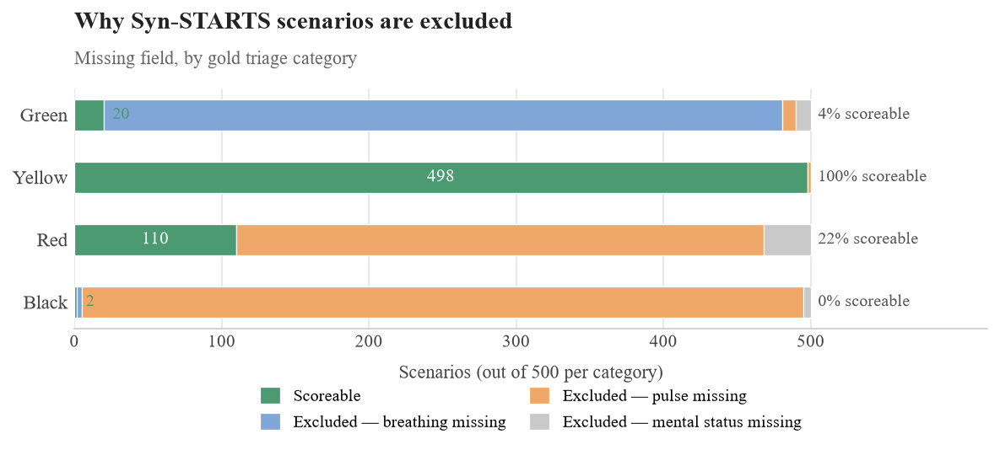

# KG-DQN - External Validation (`syn_STARTS_validation` branch)

This branch extends [`main`](../../tree/main) with an **independent external validation** of the triage ontology against a structured, third-party triage scenario dataset (the **syn_STARTS** benchmark) - separate from, and additional to, the multi-seed RL robustness experiment reported in the paper's main results (Table 1).

> **Everything not described below - the ontology, `constraint_guard.py`, the RL environment, the DQN agents, and the five core test scripts (`tests_kg.py`, `tests_hazard.py`, `tests_env.py`, `tests_dqn.py`, `tests_robustness.py`) - is identical to `main`.** See [`main`'s README](../../blob/main/README.MD) for setup, the repository structure, and how those files work. This README only documents what's unique to this branch.

---

## What this branch adds

| File | What it is |
|---|---|
| `data/syn_starts_all_scenarios.json` | 2,000 structured triage scenarios from the syn_STARTS benchmark, each with patient vitals and a clinician-assigned gold triage tag (color) |
| `data/SYN_STARTS_CONVERSION_RULE.md` | The locked, mechanical rule used to convert each scenario's raw vitals JSON into the four ontology-facing features (`ambulatory`, `breathing`, `pulse`, `follows_commands`) plus respiratory rate. A case is scored only if all required fields are present and unambiguous - no manual judgment calls, no guessing on missing data |
| `tests/tests_synSTARTS_validate.py` | Runs every convertible scenario through the **real, Pellet-backed** `constraint_guard.py` pipeline (the same reasoner-validated code path used during RL training/evaluation on `main` - not a re-implementation or a hardcoded lookup) and compares the ontology's recommended triage category against the scenario's gold tag |
| `results/syn_starts_validation_results.csv` | Per-scenario results: scenario ID, gold tag, predicted category/color, match flag, and the four converted features, for every scoreable case |

## Why this exists

The robustness experiment on `main` validates the ontology *internally* - it checks that the reasoner is logically self-consistent and that the RL agent never violates it. This branch instead checks the ontology against **external, independently authored** triage scenarios it was never built from, to see whether its classifications agree with clinical judgment on data it has never seen.

## Running the validation

From the repository root, with the same `ontologies` conda environment described in `main`'s README:

```bash
python tests/tests_synSTARTS_validate.py
```

This will:
1. Load `ontology/OWL_Ontology.rdf` and run the Pellet reasoner (same as every other test in this repo).
2. Load all 2,000 scenarios from `data/syn_starts_all_scenarios.json`.
3. Convert each scenario's vitals using the locked rule in `data/SYN_STARTS_CONVERSION_RULE.md`, excluding any scenario where a required field is missing or ambiguous.
4. Classify every convertible scenario through the real reasoner-backed pipeline and compare against the gold tag.
5. Print an overall agreement rate and a per-category breakdown, and save full per-scenario results to `results/syn_starts_validation_results.csv`.

## Results summary

Of the 2,000 raw scenarios, **348 had all required fields mechanically derivable** under the locked conversion rule (the rest were excluded, not guessed). Across those 348 scoreable cases:

| Gold category | Agreement |
|---|---|
| Green (Minor) | 14/14 |
| Yellow (Delayed) | 227/227 |
| Red (Immediate) | 105/105 |
| Black (Expectant) | 2/2 |
| **Overall** | **348/348 (100.0%)** |



*Each category is bottlenecked by a different missing field: Green
scenarios mostly lack a reported respiratory rate, Red and Black
scenarios mostly lack perfusion data (pulse/capillary refill), and
Yellow scenarios are almost never excluded - which is why Yellow
dominates the overall 630 scoreable count.*

This is a real, reasoner-derived result on every scoreable case, not a sample. Given the perfect score, it's worth double-checking the conversion rule against the gold-labeling process before citing this number, to confirm no field used in conversion is also used (directly or indirectly) to derive the gold label itself.
