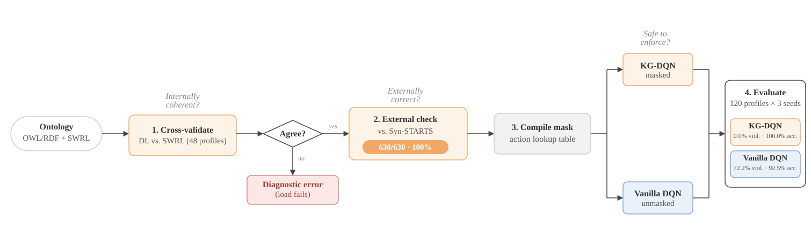
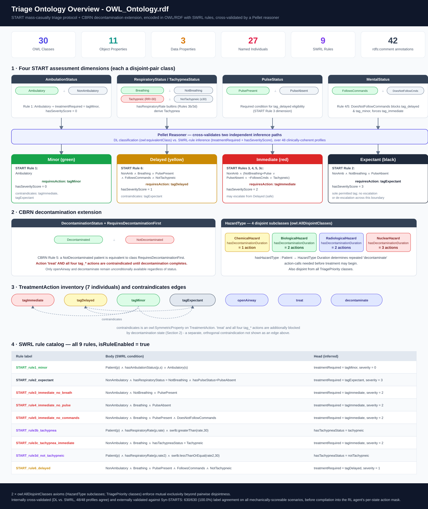
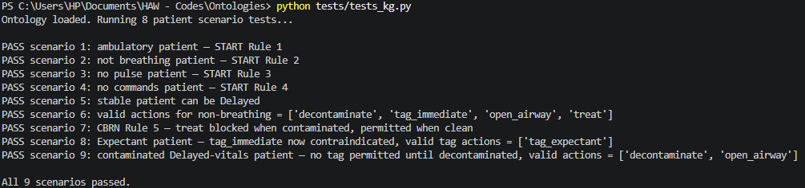
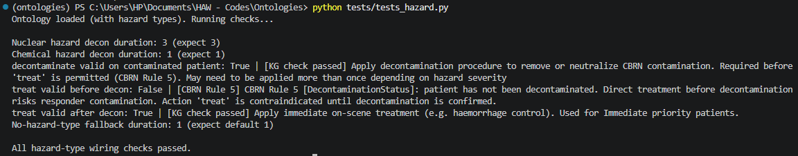
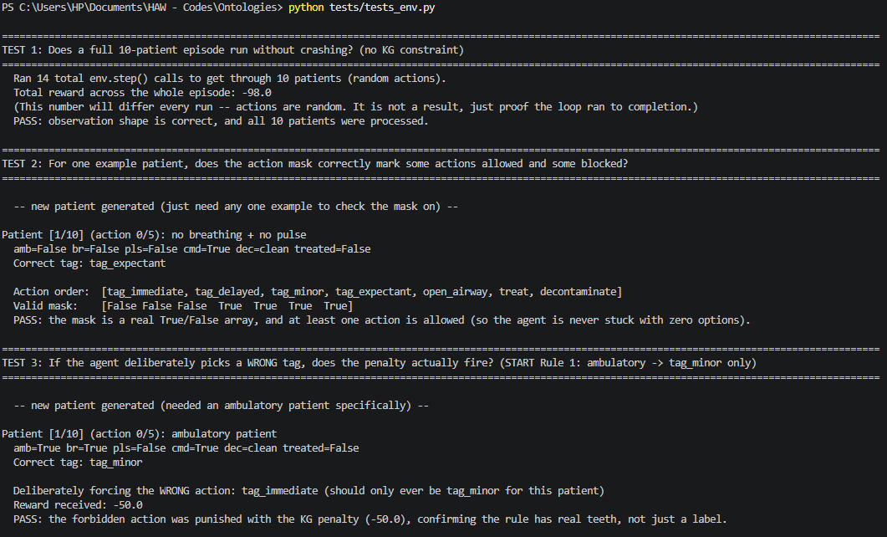
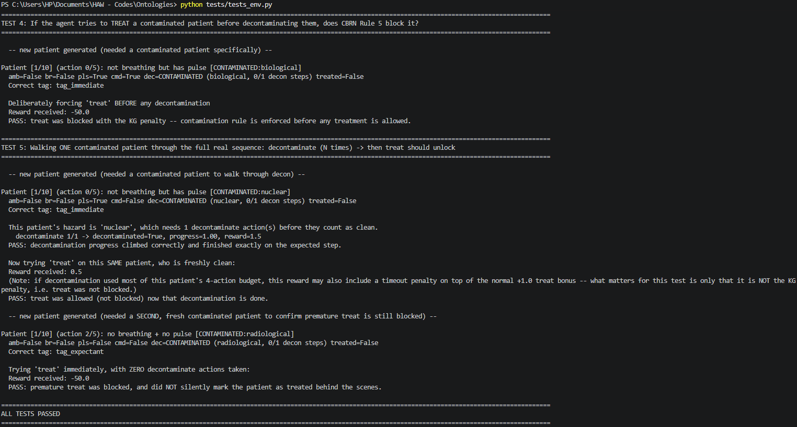
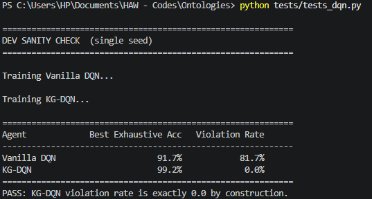
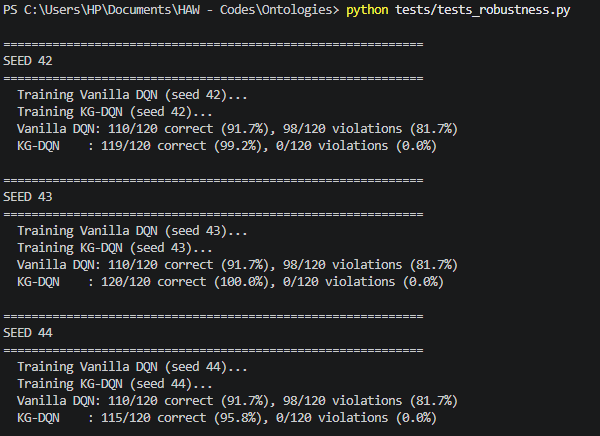
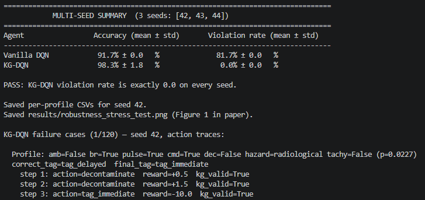
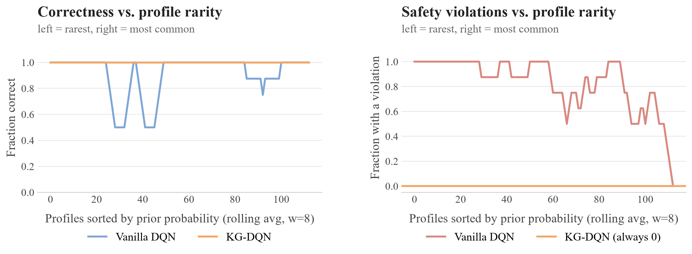

# KG-DQN: A Knowledge-Graph-Constrained Reinforcement Learning Agent for Mass Casualty Triage

This repository contains the code, ontology, and evaluation results for a short paper submitted to **KG-NeSy 2026** (Third International Workshop on Knowledge Graphs and Neurosymbolic AI, co-located with ISWC 2026, Bari, Italy).

> **In one sentence:** we encode the START mass-casualty triage protocol (plus CBRN decontamination rules) as a reasoner-validated OWL/SWRL ontology, and use it to *structurally* block a Deep Q-Network agent from ever taking a clinically unsafe action - instead of just penalizing unsafe actions and hoping the agent learns to avoid them.



> **Branches:** this is `main` - the core system, ontology, and the multi-seed robustness experiment reported in the paper. A second branch, [`syn_STARTS_validation`](../../tree/syn_STARTS_validation), shares the same ontology and reasoner code and adds an independent external validation against Syn-STARTS, a structured triage benchmark dataset (not part of the core paper experiment). That branch's headline result (630/630, 100% agreement) is summarized in the pipeline diagram above.

---

## Table of Contents

- [Why this project exists](#why-this-project-exists)
- [The core idea, explained simply](#the-core-idea-explained-simply)
- [Repository structure](#repository-structure)
- [Setup](#setup)
- [How to run everything, in order](#how-to-run-everything-in-order)
- [File-by-file guide: what each file does and what its output means](#file-by-file-guide-what-each-file-does-and-what-its-output-means)
- [Results folder](#results-folder)
- [Acknowledgments](#acknowledgments)

---

## Why this project exists

In a mass casualty incident (MCI) - a disaster, attack, or accident with more patients than available medical resources - first responders use the **START protocol** to quickly sort patients into four categories: **Minor**, **Delayed**, **Immediate**, or **Expectant**. When the incident also involves chemical, biological, radiological, or nuclear (CBRN) contamination, patients additionally need **decontamination before treatment**.

A reinforcement learning (RL) agent can, in principle, learn this sorting task from simulated experience. But a standard ("vanilla") RL agent has **no guarantee** it won't take a clinically wrong action - especially for rare patient types it barely saw during training. In a domain like triage, a wrong action means misallocating scarce resources away from a patient who could have been saved. That's not an acceptable failure mode, no matter how rare.

This project builds a **symbolic safety layer**: an OWL/RDF ontology that encodes the START rules and CBRN rules as formal logic, validated by an actual automated reasoner (not just hand-written if/else code), which is then used to **mask out** (make unselectable) any action the agent could take that would violate the protocol. The RL agent literally cannot pick a forbidden action - it's not that it's been trained to avoid it, it *physically isn't an option*.

## The core idea, explained simply

Think of it like this: a vanilla RL agent is a student who has only ever been *graded down* for wrong answers - given enough practice, they usually learn to avoid mistakes, but nothing stops them from occasionally making one, especially on questions they rarely see. Our agent is a student taking a multiple-choice test where the genuinely wrong answers have been **physically removed from the page** for certain rare/critical scenarios. They can still choose poorly among what's left, but they can never select an answer that was never offered.

We compare three agents trained on identical patient scenarios:
- **Vanilla DQN** - a standard Deep Q-Network with no safety signal at all. Unsafe actions are neither blocked nor penalized directly; the only feedback comes from the eventual +20/–10 correct/incorrect tagging reward.
- **Penalized DQN** - the same unmasked network, but unsafe actions are heavily penalized (–50 reward) when taken, while remaining *executable*. This is the classic "penalize and hope" approach, and is used as an additional ablation alongside the two conditions below.
- **KG-DQN** - the same network architecture, but unsafe actions are removed from its choices entirely via the ontology-derived mask (and would also be penalized at –50 if ever selected, though by construction they never are).

We then test all agents **exhaustively** - not just on random episodes, but on *every one of the 120 possible patient profiles* the environment can generate (the 16 binary combinations of the four core vital signs, each split by tachypnea status when breathing, crossed with clean or one of four CBRN hazard types) - across three different random training seeds, to see whether the safety guarantee actually holds everywhere, and whether it costs anything in accuracy.

The core paper result (Table 1) compares **Vanilla DQN vs. KG-DQN**; the **Penalized DQN** condition is an additional ablation, run separately (see `run_penalized_baseline.py` below) to isolate how much of the improvement comes from *masking* specifically, as opposed to just penalizing unsafe actions harder.

---

## Repository structure

```
.
├── ontology/
│   ├── OWL_Ontology.rdf              # The knowledge graph itself (OWL/RDF + SWRL rules)
│   ├── omtology_overview.svg         # Visual map of all classes, properties, and SWRL rules
├── src/
│   ├── env/
│   │   ├── dqn.py                    # Neural network architecture + replay buffer
│   │   ├── mci_env.py                # The Gymnasium RL environment (the "world" the agent acts in)
│   │   └── patient_generator.py      # Generates random simulated patients
│   ├── kg/
│   │   └── constraint_guard.py       # Bridge between the ontology and Python; runs the reasoner
│   └── eval/
│       └── exhaustive_eval.py        # Defines and runs the 120-profile exhaustive test
├── train/
│   ├── train_dqn.py                  # The training loop for both agents
│   └── random_agent.py               # Sanity-check baseline (acts completely randomly)
├── tests/
│   ├── tests_kg.py                     # Unit tests for the ontology/reasoner logic alone
│   ├── tests_kg_boundry.py             # Boundary check: RR=29/30/31 around the tachypnea threshold
│   ├── tests_hazard.py                 # Unit tests for CBRN hazard/decontamination logic
│   ├── tests_env.py                    # Tests the Gymnasium environment wiring
│   ├── tests_dqn.py                    # Quick single-seed training + comparison (dev smoke test)
│   ├── tests_rule_baseline.py          # Zero-learning baseline: always take the ontology's recommended action
│   ├── tests_shadow_feedback.py        # Optional A/B check: does penalizing the masked-out "shadow" preference reduce it?
│   └── tests_robustness.py             # THE paper's main experiment: multi-seed, exhaustive evaluation
├── run_penalized_baseline.py           # Three-way comparison: Vanilla / Penalized / KG-DQN, 3 seeds, 500 episodes
├── run_undertrained_stress_test.py     # Penalized vs. KG-DQN accuracy/violations at 50/150/500 training episodes
├── results/                            # All generated outputs land here (created automatically)
│   ├── robustness_*_seed{42,43,44}.csv                       # Per-profile, per-seed evaluation results
│   ├── robustness_vanilla.csv / robustness_kg.csv            # Seed-42 copies, kept for backward compatibility
│   └── *.png                                                 # Figures
└── README.MD                           # This file
```
---

## Setup

```bash
conda create -n ontologies python=3.10
conda activate ontologies
pip install gymnasium numpy torch owlready2 matplotlib
```

> **Note on the reasoner:** `constraint_guard.py` uses Pellet via `owlready2`. Pellet requires a Java runtime (JRE/JDK) to be installed and on your `PATH`, since Pellet itself is a Java program that `owlready2` calls out to.

All scripts assume they are run from the **repository root** (e.g., `python tests/tests_robustness.py`, not from inside the `tests/` folder), since several files resolve paths like `ontology/OWL_Ontology.rdf` relative to the working directory.

---

## How to run everything, in order

If you're setting this up fresh, run things in this order - each step builds on the last:

1. **`python tests/tests_kg.py`** - confirms the ontology and reasoner are working correctly, in isolation, before anything else touches them.
2. **`python tests/tests_kg_boundry.py`** *(optional, fast)* - a focused follow-up to step 1: confirms the tachypnea respiratory-rate threshold fires on strict `>30`, not `>=30`, at the exact boundary (rates 29/30/31).
3. **`python tests/tests_hazard.py`** - confirms the CBRN decontamination logic is wired correctly.
4. **`python tests/tests_env.py`** - confirms the RL environment itself behaves correctly (action masking, rewards, multi-step decontamination).
5. **`python tests/tests_dqn.py`** *(optional, quick)* - a fast single-seed sanity check that training runs end-to-end and the masking guarantee holds. Not the paper numbers.
6. **`python tests/tests_robustness.py`** - **this is the real experiment.** Trains Vanilla DQN and KG-DQN three times each (three random seeds), evaluates them exhaustively against all 120 profiles, and produces every number and figure reported in the paper's Table 1 / Figure 1. This takes a while - it trains six full models.
7. **`python tests/tests_shadow_feedback.py`** *(optional)* - a follow-up A/B check reported in the paper's Discussion section, not the main experiment. Trains KG-DQN twice per seed - once normally, once with the optional `shadow_feedback` intervention - and compares how often the network's raw, masked-out preference still favored a contraindicated action.
8. **`python tests/tests_rule_baseline.py`** *(optional, fast)* - a zero-learning reference point: no neural network at all, just the ontology's recommended action taken directly. Useful context for how much of the task the symbolic layer solves before any RL is added.
9. **`python run_penalized_baseline.py`** *(optional)* - trains all three conditions (Vanilla / Penalized / KG-DQN) across the same three seeds and reports the full three-way comparison, including actions-per-patient.
10. **`python run_undertrained_stress_test.py`** *(optional)* - compares Penalized DQN and KG-DQN at three training budgets (50/150/500 episodes) to show the masking guarantee holds independent of how well-trained the network is.

Steps 1–4 are fast (seconds to low minutes). Step 6 is the long one - budget real time for it. Steps 9–10 each retrain multiple models per seed, so they take at least as long as step 6.

---

## File-by-file guide: what each file does and what its output means

### `ontology/OWL_Ontology.rdf`

This is **not Python code** - it's the knowledge graph itself, written in OWL/RDF (a formal logic format), editable visually in a tool called Protégé. It defines:
- The four START categories (**Minor**, **Delayed**, **Immediate**, **Expectant**) as logical definitions over patient vitals (ambulation, breathing, respiratory rate / tachypnea, pulse, mental status, decontamination status) - not hardcoded rules, but formal class definitions a reasoner can derive conclusions from. This includes **START Rule 3** (respiratory rate > 30 → tachypneic → Immediate), encoded via a dedicated `hasRespiratoryRate` datatype property and `TachypneaStatus` class hierarchy, cross-checked by SWRL rules `START_rule3b_tachypnea` and `START_rule3c_tachypnea_immediate`, with a `NOT tachypneic` guard on `START_rule6_delayed` to prevent conflicting `treatmentRequired` assertions.
- Four CBRN hazard types (Chemical, Biological, Radiological, Nuclear), each with a required number of decontamination steps.
- SWRL rules that *independently* compute a recommended treatment action and severity score, used to cross-check the formal class definitions agree with each other.

You won't run this file directly - every other file in `src/kg/` and `src/env/` reads it.



The diagram above maps the full ontology: the four disjoint-pair assessment dimensions feeding into the Pellet reasoner's dual inference path (DL classification vs. SWRL rule inference), the resulting START category rules, the CBRN decontamination extension, the seven-action treatment inventory with its contraindication edges, and the complete 9-rule SWRL catalog.

---

### `src/kg/constraint_guard.py`

This is the bridge between the ontology file and your Python code. On load, it:
1. Reads `OWL_Ontology.rdf`.
2. Runs the **Pellet reasoner** once, over all 64 enumerable binary patient profiles (6 binary dimensions: ambulatory, breathing, pulse, follows-commands, decontaminated, tachypneic), of which **48 are clinically coherent** - the remaining 16 ("tachypneic while not breathing") are excluded as clinically meaningless. For each of the 48, it computes both the formal-logic classification *and* the SWRL-rule-based classification, and checks they agree (if they don't, it raises an error immediately rather than silently using bad data).
3. Caches the result into a fast lookup table, so every later check during training/evaluation is just a dictionary lookup rather than re-running the reasoner each time.

Exposes functions like `check_action()` (is this action allowed for this patient?), `get_valid_actions()` (the full mask of allowed actions), and `get_kg_recommended_action()` (the ontology's single recommended next action for a patient) - used by the environment, training loop, and evaluation scripts on every step.

---

### `src/env/patient_generator.py`

Generates one random simulated patient: random ambulatory/breathing/pulse/mental-status/decontamination status, plus tachypnea status (sampled conditionally on breathing), plus a random CBRN hazard if contaminated, plus the "correct" ground-truth triage tag computed from the same START logic. A tachypneic patient in the otherwise-stable branch is deterministically tagged Immediate (mirroring the ontology's `START_rule3c_tachypnea_immediate`); only the remaining non-tachypneic, otherwise-stable patients have a 15% chance of their label being stochastically escalated, to simulate real-world clinician override/uncertainty.

---

### `src/env/mci_env.py`

The actual **Gymnasium environment** - the simulated "world." Each episode presents 10 patients in sequence. The agent has 7 possible actions per step (4 tagging actions that end a patient's turn, plus `open_airway`, `treat`, `decontaminate` which keep the same patient active for up to **5** actions total). Two independent constructor flags control safety behavior: `use_kg_constraint` (when `True`, the action mask from `constraint_guard.py` is enforced - the agent cannot select a blocked action at all) and `penalize_kg_violation` (when `True`, a blocked action is still executable but incurs a –50 reward). These can be combined or used separately, which is what lets the same environment produce the Vanilla / Penalized / KG-DQN conditions. `reset_single_patient(...)` additionally lets you drop the environment directly into one hand-specified patient profile instead of sampling randomly - used by the exhaustive evaluation and the rule-only baseline.

---

### `src/env/dqn.py`

The neural network itself: a small feed-forward network (**12 inputs** → 64 → 64 → 7 outputs) that estimates how good each of the 7 actions is in a given patient state, plus a replay buffer. The 12-dimensional observation is the five binary vital signs, a treated flag, a tachypnea flag, a one-hot hazard-type encoding, and a decontamination-progress fraction.

---

### `src/eval/exhaustive_eval.py`

Defines the **120 enumerable patient profiles** - the 16 combinations of the four core binary vital signs, each further split by tachypnea status when breathing, crossed with five contamination states (clean, or one of four CBRN hazard types) - and runs a trained model against every single one, deterministically, recording whether it got the correct tag, whether it agreed with the ontology's own recommendation, and whether it ever violated the ontology along the way. This is the rigorous evaluation - not a random sample, the *entire* space of possible initial patients.

---

### `train/train_dqn.py`

The training loop. Standard epsilon-greedy DQN with a target network. **`use_kg`** (masking) and **`penalize_kg`** (the –50 reward penalty for a blocked action) are independent flags - `penalize_kg` defaults to matching `use_kg` when not given, but can be set separately to produce the "Penalized DQN" condition (`use_kg=False, penalize_kg=True`). Every 20 episodes, the current network is evaluated against the full 120-profile exhaustive set and the best-scoring checkpoint is tracked in memory. At the end of training, the best model is returned directly - no checkpoint files are written unless `save_path` is explicitly provided. It also accepts an optional `shadow_feedback` flag (default `False`) that, when enabled, pushes an extra synthetic penalty transition into the replay buffer whenever the network's raw, masked-out action preference favors a contraindicated action - see `tests/tests_shadow_feedback.py`.

---

### `tests/tests_kg.py`

**Run:** `python tests/tests_kg.py`

Isolated unit tests confirming the ontology + reasoner correctly encode each START rule and the CBRN decontamination rule, with no RL agent involved at all - pure symbolic logic checks.



Each line printed is `PASS scenario N: <description>`, ending in `All scenarios passed.`

---

### `tests/tests_kg_boundry.py`

**Run:** `python tests/tests_kg_boundry.py`

A focused boundary test on top of `tests_kg.py`. Generates individuals at respiratory rate 29, 30, and 31 across all 16 combinations of the other vitals, and confirms the DL classification and SWRL `treatmentRequired` agree everywhere - and specifically that rate=30 stays **Delayed** while rate=31 flips to **Immediate**, confirming the threshold fires on strict `>30`, not `>=30`.

---

### `tests/tests_hazard.py`

**Run:** `python tests/tests_hazard.py`

Confirms the CBRN hazard/decontamination-duration wiring specifically: that nuclear hazard requires 3 decontamination steps, chemical requires 1, that `treat` stays blocked until decontamination finishes and becomes valid immediately after.



---

### `tests/tests_env.py`

**Run:** `python tests/tests_env.py`

Tests the Gymnasium environment itself: correct observation shape (12-dimensional), correct action-space size, that the KG-constrained mode blocks wrong actions, and a full multi-step decontaminate-then-treat sequence.

<table>
  <tr>
    <td></td>
    <td></td>
  </tr>
</table>

---

### `tests/tests_dqn.py`

**Run:** `python tests/tests_dqn.py`

A **quick, single-seed** dev sanity check. Trains both Vanilla and KG-DQN once (500 episodes, same as the paper experiment) and prints a summary of the best exhaustive accuracy, violation rate, and shadow-violation rate seen during training. No checkpoint files are saved. Output is for development only - paper numbers come exclusively from `tests_robustness.py`.



The key thing to confirm: **KG-DQN's violation rate is always exactly 0.0** - this is the masking guarantee, and it must hold regardless of training quality.

---

### `tests/tests_rule_baseline.py`

**Run:** `python tests/tests_rule_baseline.py`

A zero-learning reference point - no neural network at all. At each step it simply asks the ontology for its recommended action and takes it (decontaminating first if the recommended tag isn't currently valid). Runs against all 120 exhaustive profiles and reports correctness and violation rate directly. Useful for showing how much of the task the symbolic layer already solves on its own, before any RL is added, and as a sanity ceiling for what KG-DQN should be able to reach.

---

### `tests/tests_shadow_feedback.py`

**Run:** `python tests/tests_shadow_feedback.py`

An optional **A/B check**, not part of the core paper experiment. The mask guarantees KG-DQN never *executes* a contraindicated action, but the network's raw, unmasked preference can still quietly favor one at some steps (a "shadow violation"). This script tests whether an explicit penalty on that raw preference - the `shadow_feedback` parameter in `train_dqn.py` - reduces how often it happens, by training KG-DQN twice per seed (once without the intervention, once with) and comparing exhaustive accuracy, violation rate, and shadow-violation rate between the two.

This is the experiment behind the paper's Discussion paragraph "A preliminary follow-up: penalizing the shadow preference." It's exploratory, not part of Table 1/2's core results.

---

### `tests/tests_robustness.py`

**Run:** `python tests/tests_robustness.py`

**This is the main event - the actual experiment reported in the paper.** For each of three random seeds (42, 43, 44):
1. Trains a fresh Vanilla DQN and a fresh KG-DQN from scratch (500 episodes each). Best models are kept in memory - no checkpoint files are written.
2. Evaluates both exhaustively against all 120 patient profiles.
3. Confirms (via an `assert`) that KG-DQN's violation rate is exactly zero.

After all three seeds, reports the multi-seed summary (paper's Table 1), the KG-DQN shadow-violation rate, saves per-profile CSVs for every seed, generates Figure 1, and prints full action traces for any KG-DQN failures on the primary seed (paper's Table 6).

<table>
  <tr>
    <td></td>
    <td></td>
  </tr>
</table>



Figure 1: correctness (left) and violation rate (right) as a function of profile rarity - KG-DQN is flat at perfect correctness and zero violations everywhere, while Vanilla's correctness dips on the rarest profiles and its violation rate stays high across nearly the entire spectrum.

---

### `run_penalized_baseline.py`

**Run:** `python run_penalized_baseline.py`

Runs the full **three-way comparison** - Vanilla DQN (no mask, no penalty), Penalized DQN (no mask, –50 penalty on unsafe actions), and KG-DQN (masked) - across seeds 42/43/44, 500 episodes each. Reports a mean±std summary table for all three, including a new **actions-per-patient** metric, so you can see whether masking or penalizing changes how efficiently the agent moves through a patient's treatment sequence, not just correctness and violations.

---

### `run_undertrained_stress_test.py`

**Run:** `python run_undertrained_stress_test.py`

Compares **Penalized DQN vs. KG-DQN** (not Vanilla) at three training budgets - 50, 150, and 500 episodes - across the same three seeds, printing both the mean±std and the individual per-seed accuracy/violation numbers at each budget. The point: KG-DQN's zero-violation guarantee comes from the mask, not from learned competence, so it should hold even when the network is badly undertrained - this script is the evidence for that claim.

---

### `train/random_agent.py`

**Run:** `python train/random_agent.py`

A pure sanity-check baseline: an agent that picks actions completely at random, with and without KG masking. Useful as a floor reference.

---

## Results folder

After running `tests_robustness.py`, your `results/` folder will contain:

| File | What it is |
|---|---|
| `robustness_vanilla_seed{42,43,44}.csv` / `robustness_kg_seed{42,43,44}.csv` | Per-profile results (all 120 rows) for each of the three seeds - correct tag, ontology-recommended tag, predicted tag, correctness flag, whether it matched the ontology's recommendation, violation flag, action count, etc. |
| `robustness_vanilla.csv` / `robustness_kg.csv` | Same as the seed-42 files above - kept as their own copy for backward compatibility with earlier scripts/notebooks that expect these exact filenames. |
| `robustness_stress_test.png` | The rarity-vs-correctness/violation figure (Figure 1 in the paper) |

`run_penalized_baseline.py` and `run_undertrained_stress_test.py` print their results directly to the terminal and do not currently write additional files to `results/`.

These files are what's referenced in the paper's acknowledgments section as supporting evidence for every reported number.

---

## Acknowledgments

Developed as part of doctoral research at HAW Hamburg, Faculty of Life Sciences, in collaboration with ongoing work on AI-supported maritime CBRN emergency response.